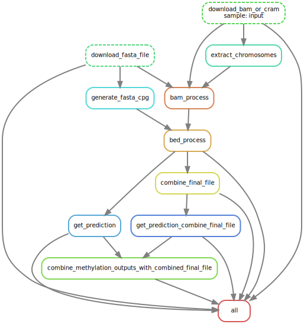

# WGS2meth

## Getting Started

Using the information of dinucleotide around which reads break during sequencing, this project aims to predict the methylation state of CpG Islands.

## What does it do?
1. The package takes a .txt file containing links to cram files as input from the 1000 Genomes project.
2. The .cram files are downloaded.
3. Converts the .cram file to a .bam file using a fasta file. The directory of the fasta file shall be edited in the config file.
4. The read positions are extracted from the bam file using bedtools.
5. The nucleotide starting positions are extracted, and then the ratio of the occurring frequency of the dinucleotide to the expected frequency of the dinucleotide.
6. Then a finalfile.csv is generated, with contains the coordinates of the CpG islands and 16 feature values, each corresponding to a dinucleotide.
7. Then a methylation_prediction.csv is generated, where the CpG Island methylation state is predicted using a pre-trained model.

8. 

## Installation

1. Clone the GitHub repository to your local machine.
```sh
  git clone https://github.com/Dinesh-Adhithya-H/MethylationPrediction.git
```
2. Go to the directory containing the git clone
```sh
  cd MethylationPrediction
```

## Requirements
Please run the following command to check if necessary tools such as samtools, bedtools, snakemake, and python are installed.

```sh
bash workflow/envs/check_tools.sh
```

Please run the bash snippets below to create a virtual Python environment with the necessary modules for this tool.
1. Create a virtual environment (Python 3)
```sh
python3 -m venv venv
```
2. Activate the virtual environment
```sh
source venv/bin/activate
```
3. Install dependencies from python_requirements.txt
```sh
pip install -r workflow/envs/python_requirements.txt
```

## Usage

1. Edit the config file 'config.yaml', to set up the mode to ensure the right directories of the dependencies is used.
``` yaml
FASTA_FILE_DIR: "Enter the directory of the fasta file"
HOME_DIR: "Home directory where the package sits in your local machine"
MODE: "train or predict mode"
RATIO: "Please enter None or a float that indicates the ratio of methylated samples in the dataset"
SAMPLE_TYPES: "SAME/DIFFERENT"
```
2. Run the snakemake file.
``` sh
  snakemake --cores 10
```

## Comments

1. Once the git repo has been cloned, the first run shall be a test run on the HG01879_hg38_chr1_1-11M.bam, where  a model trained on high coverage bam files of blood tissue type from the [1000 genomes project](http://ftp.1000genomes.ebi.ac.uk/vol1/ftp/data_collections/1000_genomes_project) can be used to predict the methylation state of CpG islands from the bam file for testing. For the test run, no edits need to be made to the config file.
